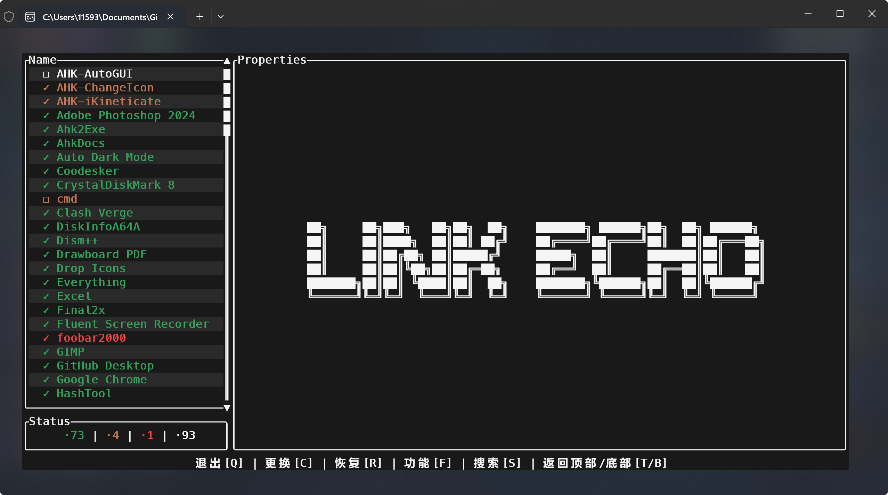
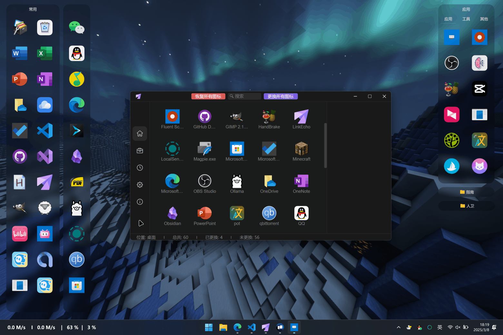
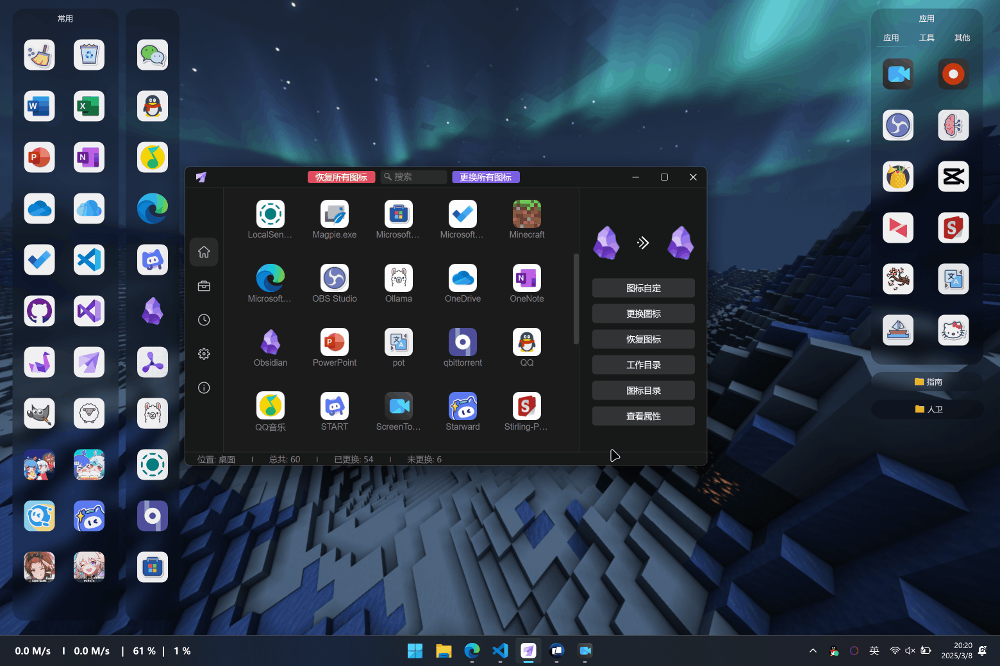

<h3 align="center">English | <a href='./README.md'>简体中文</a></h3>

# LinkEcho

One-click batch replacement, customization, or restoration of shortcut icons to refresh your desktop.

- **Simplified Operation**: Batch replace shortcut icons by matching patterns - no manual adjustments required  
- **Custom Design**: Freely adjust original/new icon dimensions & corner radius. Supports solid/gradient background layers with adjustable sizes
- **Format Support**: ICO/PNG/SVG/BMP/WEBP/TIFF/EXE formats
- **Multi-scenario**: Works on desktop, Start Menu, and shortcuts in any folder  
- **Icon Restoration**: Restore shortcut icons to default with one click

# Usage

## 🔒 Administrator Privileges

**Why required?**  
Shortcuts in `All Users` folders, `Start Menu`, and `Taskbar` are protected by Windows permissions. Temporary privilege elevation is needed to modify shortcut properties.

**Security Assurance**  
✅ No data collection  
✅ No network operations  
✅ Permission only used for modifying shortcut icon paths (Antivirus may flag)

## ✨ Features

<details>
<summary>📝 1.Batch Icon Replacement</summary>

#### Icon Matching Rules
- **Supported Formats**: `ICO`, `PNG`, `SVG`, `BMP`, `WEBP`, `TIFF`, `EXE`

  Non-.ico icons will be converted and stored in app directory

- **Matching Logic**:
  ```bash
  # Exact match (highest priority)
  Shortcut: "Visual Studio" → Icon: "Visual Studio.png"
  
  # Partial match (secondary)
  Shortcut: "Chrome" → Icon: "Chrome Beta.ico"
  Shortcut: "Chrome Canary" → Icon: "Chrome"
  ```

> **⚠️UWP/WSA Limitations**:
>  ```diff
>  - Cannot restore default icons via this tool  
>  + Fix: Manually delete and recreate shortcuts
>  ```


</details>


<details>
<summary>♻️ 2.Restore Default Icons</summary>

- **Normal Shortcuts**: Restore via button or "Restore All"
- **UWP/WSA Shortcuts**: Manually recreate via tool's shortcut creator


</details>


<details>
<summary>🎨 3.Icon Customization</summary>

#### A. Shortcut Icon Design
##### Access Path:
```bash
Tab(Home) → Shortcut → "Customize Icon"
Tab(Tool) → "Select shortcut or icon"
```

##### Customization Options:  
- **Icon Size**: 0~100%
- **Corner Radius**: 0~128px  
- **Background Layer**:
  - Supports CSS color syntax (HEX/RGB/HSL/linear-gradient) [Learn gradients](https://cssgradient.io/)
  - Adjustable size and corner radius
  ```css
  /* Solid example */
  background: #FFFFFF;
  background: rgb(255, 255, 255);

  /* Gradient examples */
  <!-- Dark gradient -->
  background: linear-gradient(45deg, #262626 40%, #444444);
  <!-- Light blue -->
  background: linear-gradient(to top, #83a4d4 10%, #b6fbff);
  ```

#### B. Icon Creation & Export  
##### Access: `Tab(Tool)` → `Select shortcut or icon`

##### Export Formats: `ICO`, `PNG`, `SVG`, `BMP`, `WEBP`, `TIFF`, `EXE`

#### Storage Path: `Tab(Tool)` → `Open converted icons folder`


</details>


<details>
<summary>📁 4.Load Shortcuts</summary>

- Load shortcuts from desktop, Start Menu, or any folder
- Backup Start Menu shortcuts before modification

</details>


<details>
<summary>🧹 5.Clear Icon Cache</summary>

- Clear system icon cache to refresh display
- System cleanup: `Win+R` → `cleanmgr` → `C:` → `Thumbnails` → `OK`

</details>


<details>
<summary>📂 6.Open Icon Directory</summary>

- Stores custom icons and converted .ico files

</details>


<details>
<summary>➕ 7.Create Shortcuts</summary>

- Access system app shortcut locations
- Create UWP/APP shortcuts

</details>


<details>
<summary>🧪 8.EXE Icon Replacement (Lab)</summary>

- ⚠️Experimental feature - Modifying .exe icons may break manifests

</details>


## Download

Github: [LinkEcho](https://github.com/iKineticate/LinkEcho/releases)

## Known Issues
1. Window resizing difficulty (Dioxus framework limitation) - Tracking [ISSUE](https://github.com/DioxusLabs/dioxus/issues/3128)

2. UWP/WSA shortcuts cannot restore default icons - Manual recreation required

3. Start Menu UWP shortcuts cannot be loaded for modification - Create new shortcuts via tool instead

## Thanks

ICON: [IconFont](https://www.iconfont.cn)

LOGO: [Freepik](https://www.flaticon.com/authors/freepik)

CSS UI: [UIVERSE](https://uiverse.io/)

## GUI based on Dioxus

<p>
    <p align="center" >
      
      <br>
    </p>
</p>