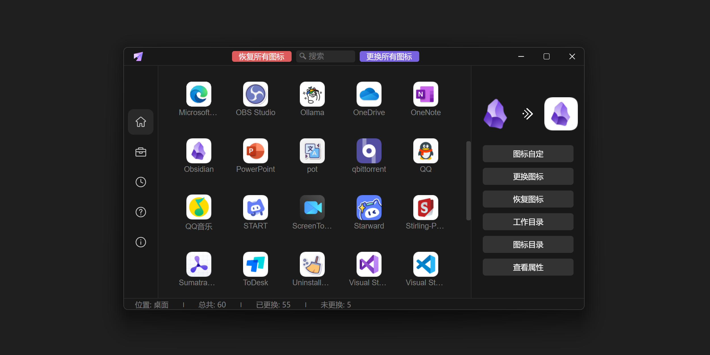

<h3 align="center"> 简体中文 | <a href='./README-en.md'>English</a></h3>

# LinkEcho

一键批量更换、自定义或还原快捷方式图标，让您的桌面焕然一新。

- **极简操作**: 选择匹配图标即可批量更换快捷方式图标，无需逐一手动设置  
- **图标自定**: 自由调节快捷方式原图标/新图标尺寸与圆角，支持纯色/渐变色背景层，亦可调节其尺寸与圆角
- **格式广泛**: 支持 ICO/PNG/SVG/BMP/WEBP/TIFF/EXE 格式
- **场景支持**: 覆盖桌面、开始菜单及任意文件夹中的快捷方式  
- **还原图标**: 随时一键恢复快捷方式图标默认状态

# 使用

## 🔒 管理员权限说明

**为何需要管理员权限？**  
`所有用户文件夹`、`开始菜单`、`任务栏`等位置的快捷方式受Windows权限保护，Windows要求临时提升权限方可修改快捷方式属性。

**安全承诺**  
✅ 不收集任何数据  
✅ 无网络传输行为  
✅ 权限仅用于修改快捷方式图标路径（杀毒软件可能识别并阻止）

## ✨ 特点

<details>
<summary>📝 1.更换所有图标</summary>

#### 图标匹配规则
- **格式支持**：`ICO`、`PNG`、`SVG`、`BMP`、`WEBP`、`TIFF`、`EXE`

  非.ico的图标会转换为.ico图标，并存储在应用目录

- **智能匹配**：图标文件需满足以下条件之一：
  ```bash
  # 精确匹配（最高优先级）
  快捷方式名 = "Visual Studio" → 图标名 = "Visual Studio.png"
  
  # 包含匹配（次要优先级）
  快捷方式名 = "Chrome" → 图标名 = "Chrome Beta.ico"
  快捷方式名 = "Chrome Canary" → 图标名 = "Chrome"
  ```

> **⚠️UWP/WSA 应用限制**：
>  ```diff
>  - 更换后无法通过本工具恢复默认图标   
>  + 恢复方法：需手动删除快捷方式并重新创建
>  ```


</details>


<details>
<summary>♻️ 2.恢复默认图标</summary>

- **普通快捷方式**：通过「恢复图标」按钮恢复 或「恢复所有图标」按钮一键恢复
- **UWP/WSA 快捷方式**：需手动重建快捷方式（工具界面 -「创建应用快捷方式」 - 创建指定快捷方式）


</details>


<details>
<summary>🎨 3.图标自定设计</summary>

#### 一、快捷方式图标自定义
##### 操作路径:
```bash
主界面 → 快捷方式 → "图标自定"
工具界面 → "选择快捷方式或图标"
```

##### 调节项：  
- **图标尺寸**：0~100%
- **图标圆角**：0~128px  
- **背景层**：
  - 支持 CSS 颜色语法（HEX/RGB/HSL/linear-gradient）[渐变色网页](https://cssgradient.io/)
  - 支持调节背景层大小及圆角
  ```css
  /* 纯色示例 */
  background: #FFFFFF;
  background: rgb(255, 255, 255);

  /* 渐变示例 */
  <!-- 渐变黑色 -->
  background: linear-gradient(45deg, #262626 40%, #444444);
  <!-- 浅蓝色 -->
  background: linear-gradient(to top, #83a4d4 10%, #b6fbff);
  ```

#### 二、独立图标创作与保存  
##### 操作路径：`工具界面` → `选择快捷方式或图标`

##### 图标格式：`ICO`、`PNG`、`SVG`、`BMP`、`WEBP`、`TIFF`、`EXE`

#### 保存路径：`工具界面` → `打开转换图标目录`


</details>


<details>
<summary>📁 4.载入快捷方式</summary>

- 支持载入桌面、开始菜单或其他文件夹中的快捷方式
- 谨慎更换开始菜单快捷方式图标，如需更换请备份快捷方式

</details>


<details>
<summary>🧹 5.清理图标缓存</summary>

- 清理系统图标缓存，刷新图标
- 系统磁盘清理：`Win+R` → `cleanmgr` → `C盘` → `缩略图` → `确认`

</details>


<details>
<summary>📂 6.打开图标目录</summary>

- 存放自定义图标，以及更换快捷方式图标为非.ico的图标时，目标图标转化为.ico的图标

</details>


<details>
<summary>➕ 7.创建快捷方式</summary>

- 打开系统应用快捷方式目录
- 支持创建UWP、APP等快捷方式

</details>


<details>
<summary>🧪 8.更换EXE图标</summary>

- ⚠️目前为实验室功能，可更换.exe程序图标，但可能破坏程序清单导致程序异常，谨慎使用

</details>


## 下载

Github: [LinkEcho](https://github.com/iKineticate/LinkEcho/releases)

蓝奏云: [LinkEcho]() (密码: 6666)


## 已知问题
1. 调节窗口大小困难，目前为Dioxus框架问题，需等待[ISSUES](https://github.com/DioxusLabs/dioxus/issues/3128)解决

2. UWP和WSA应用的快捷方式不支持恢复默认图标，如需恢复默认图标需手动创建

3. 无法载入开始菜单中的UWP快捷方式以进一步更换图标，可创建该快捷方式并移至开始菜单即可代替

## 感谢

图标: [IconFont](https://www.iconfont.cn)

LOGO: [Freepik](https://www.flaticon.com/authors/freepik)

CSS UI: [UIVERSE](https://uiverse.io/)

## GUI based on Dioxus

<p>
    <p align="center" >
      
      <br>
    </p>
</p>

